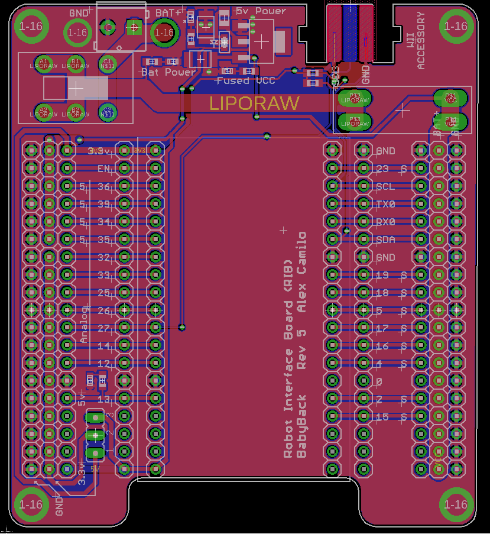

### Robot Interface Board

The Robot Interface Board (RIB) is a breakout board for the [ESP32-DevKitC Arduino module](https://www.digikey.com/product-detail/en/espressif-systems/ESP32-DEVKITC-32D-F/1965-1003-ND/9693290). The Dev Kit C is a reference design of the ESP32-WROOM-32 module which houses the WiFi and bluetooth Antenae. The ESP32-WROOM-32 module houses an ESP32 microcontroller. 

#### Datasheet

[Arduino compatiple DevkitC]( https://esp-idf.readthedocs.io/en/latest/get-started/get-started-devkitc.html)

[ESP32 Microcontroller]( https://www.espressif.com/sites/default/files/documentation/esp32_datasheet_en.pdf)

[ESP32-DevKitC Arduino module wireing diagram ](https://dl.espressif.com/dl/schematics/esp32_devkitc_v4-sch-20180607a.pdf)


## PCB



## ESP32Dev Board PINMAP


## IO Pin counts

There are 16 I/O pins availible for use in your programs with no external perpheral already using them.

There are 21 I/O pins availible for use in your programs including the 5 output only strapping pins.

There are 27 I/O pins availible for use in your programs by reusing the boot button pin, serial pins and i2c pins for other purposes. 

## User Button

There is a button connected to pin 0 and is accessible to the users code as a button. If you hold it whild pressing the reset button, however, it will hold the chip in bootloader mode and it will not run your code until the core is reset or programmed over the USB. Once your code starts, this button is availible for use as a button in your code and pressing it will not effect the opperation of the core after your program has started.  

## Pins to Never Use because they will disrupt programming and opperation:

6-11    - These pins are hookups for external system flash and are used by the system flash. Unless you are extending the chips flash capibilities, do not use these. 

1 and 3 -  these are used to program the device and are serial port pins.

## Output Only Pins 

These pins are strapping pins for the core, if pulled to a different state than the default not boot.

These are strapping pins and have to be in known states at the time of the chip booting. If you use them as outputs, be careful to note the the pull up or down resistor states for each. When using these pins make sure the weak-pull resistor will not interfeare with your intended opperation, and do not add additional weak-pull resistors.

```
2  (pull down)
5  (pull up)
12 (pull down)
13 (pull up)
15 (pull up)
```
## Input Only pins

34-39 are input only. They have no output modes at all. Analog input and digital input are availible.

```
35
34
39
36
```

## Availible as Both Input and Output

```
4
12
14
16-19
21-23
25-27
32-33
```
## External Use pins

0 is the boot pin, if held low during a reset it will prevent the device from booting

1 and 3 are the serial port used for programming and print statements. This should not be used for user functions, but can be used if serial functionality is needed.

13 Has an LED connected to it on the RIB

22 and 21 have 4.7kOhm pullups on them and are connected to the Wii accessory port. These can be used with other i2c devices.
See: https://github.com/acamilo/RobotInterfaceBoard/issues/31

27 Is connected to the Wii header as controller detect. When the controller is connected, this is pulled to 3.3v. It is open when the controller is not connected.  

## Availible Servo/PWM/AnalogWrite Pins

The ESP32 can generate up to 16 simultanious Servo signels. 

```
4     
5    
12-19 
21-23 
25-27 
32-33 
```

### Timer distribution for PWM
The ESP32 has 4 timers availible for use in PWM generation. All PWM channels using a given timer have the same base frequency. Changing the frequency of a channel will change the frequency of other channels. Note the chart for how the PWM channel allocations coorospond to timers:

```
/*
 * LEDC Chan to Group/Channel/Timer Mapping
** ledc: 0  => Group: 0, Channel: 0, Timer: 0
** ledc: 1  => Group: 0, Channel: 1, Timer: 0
** ledc: 2  => Group: 0, Channel: 2, Timer: 1
** ledc: 3  => Group: 0, Channel: 3, Timer: 1
** ledc: 4  => Group: 0, Channel: 4, Timer: 2
** ledc: 5  => Group: 0, Channel: 5, Timer: 2
** ledc: 6  => Group: 0, Channel: 6, Timer: 3
** ledc: 7  => Group: 0, Channel: 7, Timer: 3
** ledc: 8  => Group: 1, Channel: 0, Timer: 0
** ledc: 9  => Group: 1, Channel: 1, Timer: 0
** ledc: 10 => Group: 1, Channel: 2, Timer: 1
** ledc: 11 => Group: 1, Channel: 3, Timer: 1
** ledc: 12 => Group: 1, Channel: 4, Timer: 2
** ledc: 13 => Group: 1, Channel: 5, Timer: 2
** ledc: 14 => Group: 1, Channel: 6, Timer: 3
** ledc: 15 => Group: 1, Channel: 7, Timer: 3
*/
```

When using ESP32PWM objects, changing the frequency will check for timer cross-talk. If you re-set the frequency of a PWM indirectly, the object will print this warning:

```
	WARNING PWM channel 1 shares a timer with 0
	changing the frequency to 330.00 Hz will ALSO change channel 0 
	from its previous frequency of 50.00 Hz
```

If you get this warning you can space out the attach events of the hardware using ESP32PWM using dummy objects. To consume a channel without activating a pwm, you can add this to your code between attach method calls. 

```
ESP32PWM dummy;
dummy.getChannel();
```
## Availible DAC pins
```
25
26
```
These pins when used with analogWrite will produce an 8 bit analog value on the given pin. The value is from 0-3.3v mapped to 0-255 values. The api is to simply use analogWrite().


## Interrupt

For code examples: https://techtutorialsx.com/2017/09/30/esp32-arduino-external-interrupts/

Availible interruptable pins are all input pins.


# Development Computer Options  

## Option 1) A lab machine

Availible to all students. 

Note that the driver is installed on these computers

Note that Arduino with the ESP32 toolchain is already installed in C:\WPIAPPS\arduino-1.8.3\

Note Eclipse is installed on all workstations with the Sloeber plugin installed. 

##  Option 2) Personal Machine

### Supported for this class

Windows 10 Pro 

A user name with no " " in the file path. Generally it is safe to use your WPI username as the username on your computer.

Fresh install is genearlly reccomended every 6 months. Install disk are availible to students as a resource from the WPI Helpdesk.

OneDrive and Dropbox conflict with the install process and must be fully removed from the user file paths. 

Eclipse should be installed in 

```
C:/eclipse
```

Arduino should be installed in 

```
C:/RBE-arduino-install/
```

After installation of both, ensure your user has write access to the directories. 

### Unsupported OS's

MacOS is unsupported and only intermittantly working. Drivers have been an issue with programming our board, and virtualization of Windows within OSX is tested non-working. If you have Mac OSX please install a fresh copy of Windows 10 nativly and dual boot. 

Ubuntu 16.04 is unsupported but works well.

Ubuntu 18.04 is unsupported but works well with some creative directions following. This will take more effort and would require pre-existing proficency in Linux. If you have 18.04 please install Windows 10 or 16.04. 

### How to get Windows 10 as a Student for free from WPI

To get your student copy of Windows go here: 

https://onlinestore.wpi.edu/

Select windows 10, and download it. For students you get one copy and it is free. 

You can follow this tutorial to install it:

https://www.youtube.com/watch?v=aTVOTY93XXU

# Arduino and the ESP32 Toolchain

## Driver

This is installed on the lab machines already. 

After extracting the Zip file, install the 64 bit version of the driver. 

https://www.silabs.com/products/development-tools/software/usb-to-uart-bridge-vcp-drivers


## Personal Computer install Windows  (Supported)

download:

https://github.com/WPIRoboticsEngineering/RobotInterfaceBoard/releases/download/rev5-1/RBE-arduino110718.zip

And extract it on your computer in 

```
C:/RBE-arduino-install/
```

Make a sketchbook folder in C:/, or (R:/ on the lab machines) make a folder:

```
C:/RBEArduino/
```

Make sure it is user level read-write

Run Arduino in the extracted folder.


Open the Preferences in Arduino and set the Sketchbook location to:

```
C:/RBEArduino/
```

## Personal Computer install Linux / Mac  (Unsupported)

Ubuntu 18.04 Instructions:

[InstallToolchainOnUbuntu18-04.md](InstallToolchainOnUbuntu18-04.md)

Ubuntu 16.04 Instructions:

https://github.com/espressif/arduino-esp32/blob/master/docs/arduino-ide/debian_ubuntu.md


Mac instructions (NOT SUPPORTED BY RBE, HAS LOTS OF PROBLEMS):

https://github.com/espressif/arduino-esp32/blob/master/docs/arduino-ide/mac.md

# Development of your code

After your Arduino is installed and the ESP32 toolchain is up and running, open Arduino IDE and Select your board:

```
Tools->Board->ESP32 Dev Module
```

And select your port:

```
Tools->Port-> (the port that your arduino is connected to)
```

## (Optional) Install Eclipse on Personal Machine

 [See Eclipse install instructions in InstallEclipse.md](https://github.com/WPIRoboticsEngineering/RobotInterfaceBoard/blob/master/InstallEclipse.md)

## Clone your project
You may either 

Use [Arduino IDE and Github Desktop](https://github.com/WPIRoboticsEngineering/RobotInterfaceBoard/blob/master/UseArduinoGithubDesktop.md)

or
 
(Optional) Use Eclipse [using the Eclipse instructions](https://github.com/WPIRoboticsEngineering/RobotInterfaceBoard/blob/master/UseEclipse.md)

# Arduino Libraries
## HOWTO
For detailed instructions on how libraries work, see: https://www.arduino.cc/en/Guide/Libraries

Open Arduino and select Sketch->Libraries -> Manage Libraries
## Which Libraries

### 1001

ESP32Servo

ESP32Encoder

### 2001
Search for and install:

ESP32Servo

ESP32Encoder

Esp32SimplePacketComs

SimplePacketComs


### 2002
Search for and install:

ESP32Servo

ESP32Encoder

Adafruit_BNO055

Adafruit Unified Sensor

Esp32SimplePacketComs

SimplePacketComs

WiiChuck

DFRobotIRPosition

PID

# FAQ and troubleshooting

### "I dont see 'ESP32 Dev Module' as an option in Arduino when I try to select my board..."

* Use a lab machine. This will not be a problem on the lab machines. 

* You need to install the ESP 32 toolchain. See https://github.com/WPIRoboticsEngineering/RobotInterfaceBoard#personal-computer-install-windows--supported


### "I can compile the code but I do not have a serial port option in Arduino..."

* Ensure the driver installed https://github.com/WPIRoboticsEngineering/RobotInterfaceBoard#personal-computer-install-windows--supported

* If its a MAC, this is the issue that causes us to say MacOS is UNSUPPORTED. Install Windows https://github.com/WPIRoboticsEngineering/RobotInterfaceBoard#how-to-get-windows-10-as-a-student-for-free-from-wpi

* Make sure the USB Micro cable is a data cable, not just a crappy USB charging cable with no data lines. 

### "I can select the correct serial port, put it wont program or times out while programming..."

* Program an example script using Lab computer   (if this works have them re-download the pre-packaged arduino from https://github.com/WPIRoboticsEngineering/RobotInterfaceBoard#personal-computer-install-windows--supported ) 

* Is the serial moniter open? Close it and try again. 

* Did it program earlier? Unplug the USB and plug it back in.

* Hold Boot button and Strobe the enable button to set core into bootloader mode. Try to program. (If this helps, you are printing too much data to the serial port)

* Unplug everything from all IO (If this fixes it, check the pins and voltages, also check for diode dead-shorts check https://github.com/WPIRoboticsEngineering/RobotInterfaceBoard#pins-to-never-use )

* Check to see if the processor or regulator is HOT. If it is, a dead-short or over-voltage event occured and the device is dead forever. Replace. 


### "I can program it but it but it keeps rebooting over and over..."

* Null pointers are the #1 cause of this behavior, use print statements to isolate the point where it reboots and check for null pointers. This is the issue 9 out of 10 times. 

* Interrupt issues - Interrupts that access memory that is used by non-interrupt code without a mutex or semiphore. Try disabling the interrupt and if this fixed the reboot issue, then go ahead and implement the mutex locking. 

* Something may also be plugged into one of the off-limits pins, or your code is reconfiguring and messing up one of these pins. See: https://github.com/WPIRoboticsEngineering/RobotInterfaceBoard#pins-to-never-use 

### "This processor seems more complicated than the Uno and the Mega, why are we using it?"

* The ESP32 is a faster core at 260Mhz, vs the 16Mhz Uno. It is also dual-core.

* It has more perpherals needed for building robots, 16x 12 bit ADC, 2x DAC and 16 hardware encoder perpherals

* It has hardware and software that support WiFi for communications. 

* 32 bit processing with an FPU means complex math is possible on the microcontroller. 

* It is Arduino compatible for programming and Library support

* It is an open source design of the DevKit-C module, using an open source MIPS core and open soruce tool-chain

