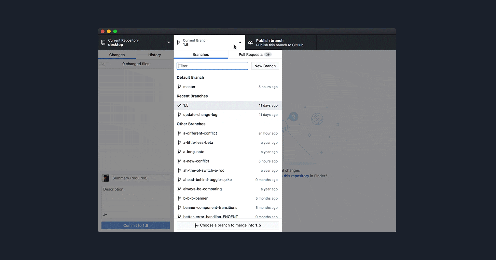

1. Uninstall stale arduino
1. Open Github Desktop
1. Clone a Repository
1. Open Directory Where Your Code Lives
1. Set RBE Arduino as program to open INO
    1. Install Arduino for RBE
1. Set Up Arduino Preferences
    1. Set Sketchbook folder 
    1. Set check boxes
1. Install libraries
1. Set the ESP32 Board
1. Set the port
    1. Install the driver
1. Verify to compile the code
1. Program and open serial moniter

# Git Work flow

## Once at the start of a project

Make a branch for each developer

## Decompose Problems into bite-sized issues

### Make issues for task deligation

### Issues for non-code tasks (Building and Wireing) 

## Development Loop 
1. Commit and push changes
    1. Commit message format
    1. One issue per commit, many commits per issue
    1. Issue numbers in commit messages
1. Pull Request working changes to Master
1. Pull Changes from Master
    1. Merge Conflicts  
   
    1. Push changes to your branch

    
  
